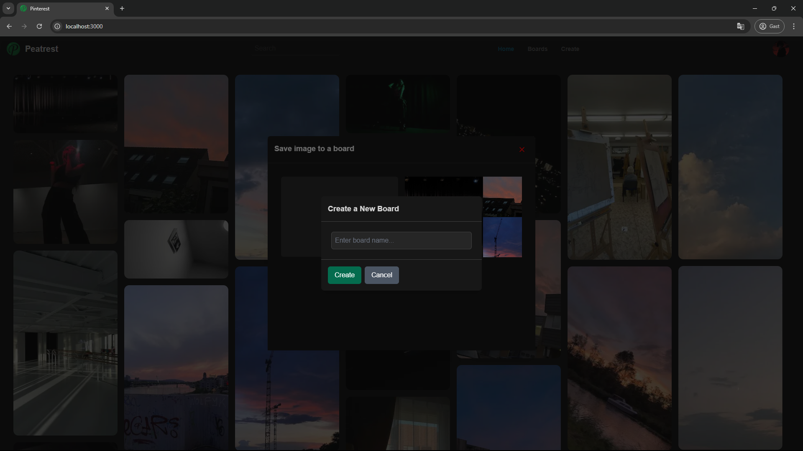

# Peatrest

## Description
I created to project to experiment with Next.js and Prisma Client. I created a simple CRUD where you can create a board with a name, add pictures to it and delete it. I also created a Dynamic Routing to show the board images that were added. The project might seem simple but it was a great learning experience. I probably will add more features to it in the future.

## Project uses
- Next.js
- Prisma Client
- React
- TypeScript
- Tailwind CSS

## How to run the project
1. Clone the repository
2. Run `npm install` to install the dependencies
3. Run `npm run dev` to start the development server
4. Access `http://localhost:3000` to see the project running

To change data in the seeder you can access the `prisma/seed.ts` file and change the data there.

## Screenshots
### Home

### Save Image

### Create Board

### Board's

### Board with images

# Credits for the images
- [Photo by Anett Rei](https://nl.pinterest.com/anett_rei/_created/)
